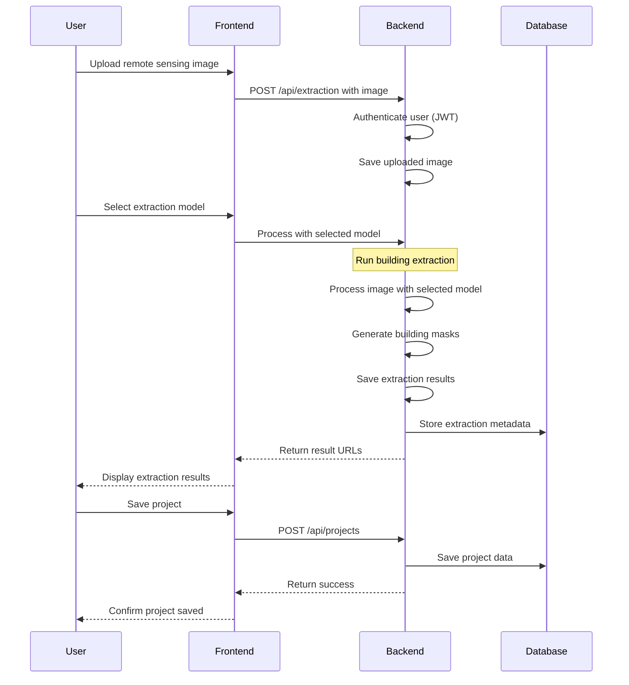

# Simplified Building Extraction Process Sequence Diagram

## Diagram Explanation

This simplified sequence diagram illustrates the essential flow of the building extraction process:

1. User uploads a remote sensing image through the frontend
2. User selects a model for building extraction
3. Backend processes the image using the selected model
4. Results are displayed to the user
5. User can save the project for future reference

The diagram focuses on the core user interactions and essential system operations without detailed implementation specifics. 