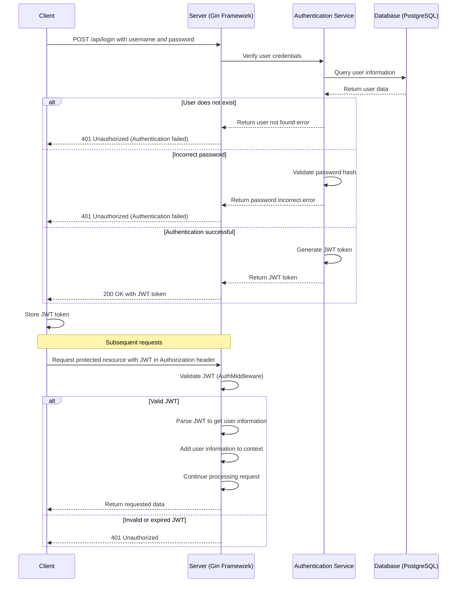

# JWT Login Sequence Diagram

## Diagram Explanation

1. **Login Process**:
   - Client sends username and password to the `/api/login` endpoint
   - Server passes credentials to the Authentication Service for validation
   - Authentication Service queries user information from the database
   - If validation is successful, a JWT token is generated and returned to the client
   - Client stores the JWT token for subsequent requests

2. **Protected Resource Access Flow**:
   - Client includes the JWT token in the Authorization header of the request
   - Server's AuthMiddleware intercepts the request to validate the JWT
   - If the JWT is valid, user information is extracted from the token and added to the request context
   - If the JWT is invalid or expired, a 401 Unauthorized error is returned

3. **JWT Structure**:
   - Header: Contains token type and encryption algorithm used
   - Payload: Contains user information (such as user ID, roles, etc.) and expiration time
   - Signature: Generated using the server's secret key to ensure the token has not been tampered with

This sequence diagram illustrates the main interaction steps in the JWT authentication process for your building extraction backend project. 